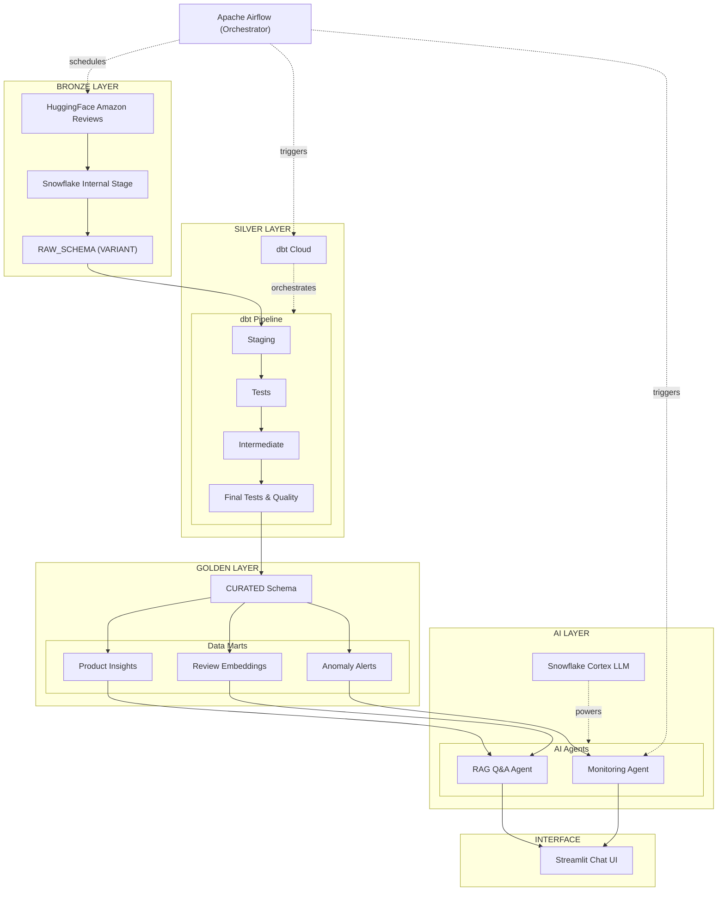

# ReviewSense AI

## Overview

ReviewSense AI is a Customer Review Insights Copilot built on Snowflake and GenAI. It analyzes Amazon product reviews to generate insights such as sentiment, themes, complaints, and improvement suggestions.

## Problem

Customer reviews are unstructured and difficult to analyze manually at scale.

## Solution

We built a Snowflake-based data pipeline and GenAI workflow to:

- Ingest and clean review data
- Structure reviews for analytics
- Enable embedding and RAG workflows
- Generate product insights using Cortex LLM

## Architecture

Pipeline layers:

RAW → CURATED → ANALYTICS → GenAI

| Layer | Technology | Purpose |
|-------|------------|---------|
| Data Source | HuggingFace Datasets | Amazon Reviews extraction |
| File Format | Apache Parquet | Columnar, compressed storage |
| Data Warehouse | Snowflake | Storage + Cortex AI |
| Transformation | dbt | SQL modeling & testing |
| Orchestration | Apache Airflow | Pipeline scheduling |
| AI/ML | Snowflake Cortex | LLM & Embeddings |
## Tech Stack

- Snowflake (Data Warehouse)
- Snowflake Cortex AI
- SQL
- GitHub

## Current Progress

Completed:

- Data ingestion
- Data transformation
- Data validation
- Analytics preparation

Next steps:

- Embeddings
- RAG pipeline
- Insight generation

## Project Log

See: docs/project_log.md
